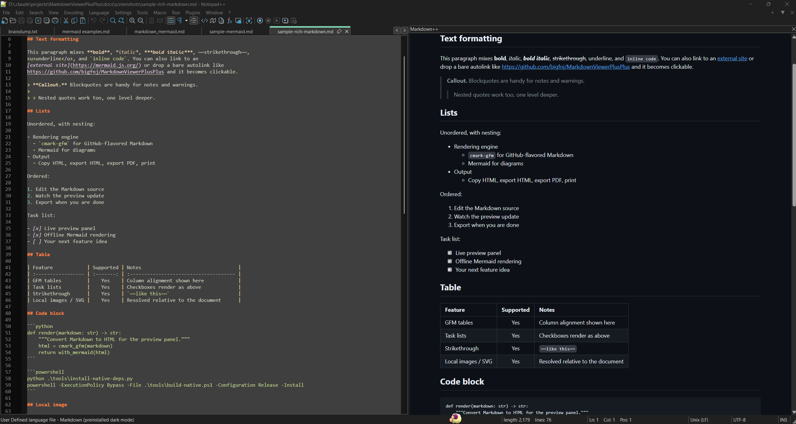
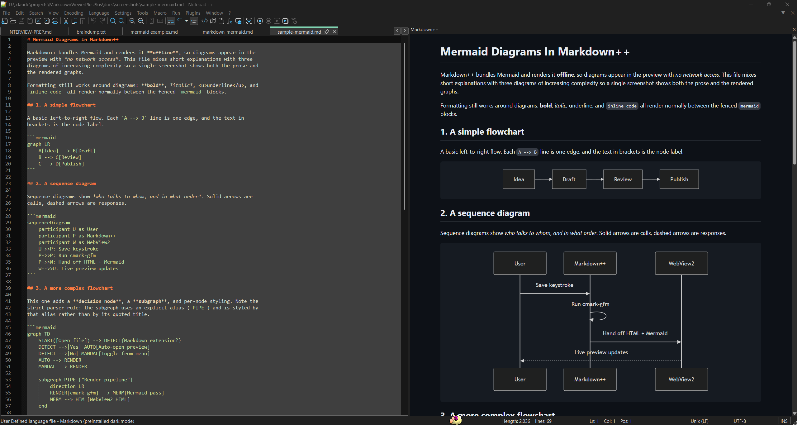
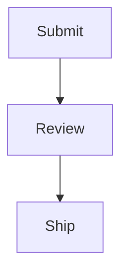

# Markdown++

A native x64 Notepad++ plugin for live Markdown preview.

Markdown++ renders the file you are editing in a dockable preview panel powered by
Microsoft Edge WebView2. It uses [`cmark-gfm`](https://github.com/github/cmark-gfm)
for GitHub-flavored Markdown and bundles [Mermaid](https://mermaid.js.org/) so
diagrams render fully offline.


## Screenshots

**Live preview of GitHub-flavored Markdown.** The editor is on the left, the
Markdown++ panel renders headings, callouts, links, and inline code on the right
as you type.



**Bundled, offline Mermaid diagrams.** A fenced `mermaid` block in the source
becomes a rendered flowchart in the preview, with no network access required.



## Features

**Rendering**

- Dockable live preview panel backed by the Edge WebView2 runtime.
- GitHub-flavored Markdown through `cmark-gfm`: tables, task lists, strikethrough, and autolinks.
- Bundled Mermaid diagrams rendered offline. A malformed diagram shows its error inline instead of breaking the rest of the document.
- Local images and SVGs resolved relative to the current document through a virtual host.

**Navigation**

- Local Markdown links open or switch to the target file in Notepad++.
- External `http` and `https` links open in your default browser.
- Fragment links (`#heading`) scroll both the preview and the editor.
- Source-line scroll sync keeps the editor and preview aligned, including at the end of the document.

**Export and output**

- Copy the rendered HTML to the clipboard.
- Export a standalone HTML file with working fragment jumps.
- Export a standalone PDF.
- Open the WebView2 system print dialog.

**Convenience**

- Auto-open the preview for common Markdown extensions: `.md`, `.markdown`, `.mdown`, `.mkd`, `.mkdn`.
- Settings persist as plain menu toggles, so there is no separate options dialog to manage.

## Requirements

- Windows, x64.
- Notepad++, x64.
- [Microsoft Edge WebView2 Evergreen Runtime](https://developer.microsoft.com/microsoft-edge/webview2/). Most Windows 11 machines already have it. If it is missing, the plugin detects this and shows install guidance directly in the preview panel.

## Installation

Every release on the [Releases page](https://github.com/bigfnj/MarkdownViewerPlusPlus/releases)
ships two options: an MSI installer and a standalone zip.

### Option A: MSI installer (recommended)

1. Download `MarkdownPlusPlus-<version>-win-x64.msi`.
2. Run it. The installer auto-detects your 64-bit Notepad++ install and places the
   plugin in its `plugins\MarkdownPlusPlus` folder. Close Notepad++ first, or the
   installer will prompt you to.
3. Start Notepad++ and open a Markdown file, or use
   **Plugins > Markdown++ > Markdown++**.

The installer requires 64-bit Notepad++ and shows a clear message if it cannot find
one. To upgrade later, run the newer MSI. Re-running the **same** version reinstalls
in place, which repairs a broken or corrupted install and never leaves a duplicate
entry. To remove it, use **Add or Remove Programs**.

### Option B: standalone zip (manual)

1. Download `MarkdownPlusPlus-<version>-win-x64.zip`.
2. Extract it. You should get a `MarkdownPlusPlus` folder that contains
   `MarkdownPlusPlus.dll` and an `assets` folder.
3. Copy that whole `MarkdownPlusPlus` folder into your Notepad++ `plugins`
   directory. On a default install the final path is:

   ```text
   C:\Program Files\Notepad++\plugins\MarkdownPlusPlus\MarkdownPlusPlus.dll
   ```

4. Restart Notepad++.

Because the default Notepad++ location is under `C:\Program Files`, the manual copy
needs Administrator rights. Use an elevated file manager or an elevated PowerShell
window for the copy.

## Usage

The plugin adds a **Markdown++** submenu under **Plugins** with direct commands:

| Command | What it does |
| --- | --- |
| `Markdown++` | Toggle the preview panel. |
| `Refresh preview` | Re-render the current document. |
| `Copy HTML to clipboard` | Copy the rendered HTML. |
| `Export HTML...` | Save a standalone HTML file. |
| `Export PDF...` | Save a standalone PDF. |
| `Print...` | Open the WebView2 print dialog. |
| `Open automatically for Markdown files` | Toggle auto-open for Markdown extensions. |
| `Synchronize scrolling` | Toggle editor/preview scroll sync. |
| `Render Mermaid diagrams` | Toggle Mermaid rendering. |
| `Preview update delay` | Set the debounce delay before re-rendering. |
| `About` | Show version and plugin information. |

The toggle and delay settings are persisted, so they carry over between sessions.

## Mermaid Diagrams

Mermaid is bundled and rendered offline. Wrap each diagram in a fenced code block
tagged `mermaid`:

````markdown

````

The parser is strict about subgraph identifiers. Give every subgraph an explicit
alphanumeric alias, and style the alias rather than a quoted title.

Incorrect, styling a quoted title will not apply:

```text
subgraph "Security Review Stage"
    direction LR
end
style "Security Review Stage" fill:#fff
```

Correct, style the alias:

```text
subgraph STAGE2 ["Security Review Stage"]
    direction LR
end
style STAGE2 fill:#fff
```

For a subgraph with no visible title, alias it and pass a single space:

```text
subgraph GATE1 [" "]
    direction LR
    G1[Gate]
end
```

## Build From Source

Building requires Visual Studio 2026 v18 (MSVC v145) with a Windows 10/11 SDK, and
CMake 4.2 or newer for the `Visual Studio 18 2026` generator.

Install the repo-local dependencies (WebView2 SDK, `cmark-gfm`, Mermaid):

```powershell
python .\tools\install-native-deps.py
```

Build and package a Release:

```powershell
powershell -ExecutionPolicy Bypass -File .\tools\build-native.ps1 -Configuration Release -Package
```

Build, package, and install into Notepad++ in one step:

```powershell
powershell -ExecutionPolicy Bypass -File .\tools\build-native.ps1 -Configuration Release -Install
```

Close Notepad++ before installing so `MarkdownPlusPlus.dll` is not locked. Full
build, packaging, and install details are in [BUILDING_NATIVE.md](BUILDING_NATIVE.md).

The packaged plugin folder contains runtime files only:

```text
MarkdownPlusPlus/
  MarkdownPlusPlus.dll
  assets/
    preview.css
    preview.js
    mermaid/
      mermaid.min.js
      README.md
```

## Repository Layout

```text
MarkdownPlusPlus.Native/   Native plugin source, assets, and native docs
installer/                 WiX MSI installer project and build script
smoke-tests/               Manual smoke-test Markdown fixtures
tools/                     Dependency, build, and install helpers
docs/screenshots/          README screenshots
BUILDING_NATIVE.md         Full native build instructions
CMakeLists.txt             Native CMake entry point
CMakePresets.json          Visual Studio 2026 and 2022 x64 presets
```

## Credits

Markdown++ is a native rewrite in this fork of
[bigfnj/MarkdownViewerPlusPlus](https://github.com/bigfnj/MarkdownViewerPlusPlus),
forked from [nea/MarkdownViewerPlusPlus](https://github.com/nea/MarkdownViewerPlusPlus)
and based on the original Markdown Viewer++ by Savas Ziplies.

## License

Released under the MIT License. See [LICENSE.md](LICENSE.md).

Native dependency setup and third-party notices are documented in
[MarkdownPlusPlus.Native/DEPENDENCIES.md](MarkdownPlusPlus.Native/DEPENDENCIES.md).
