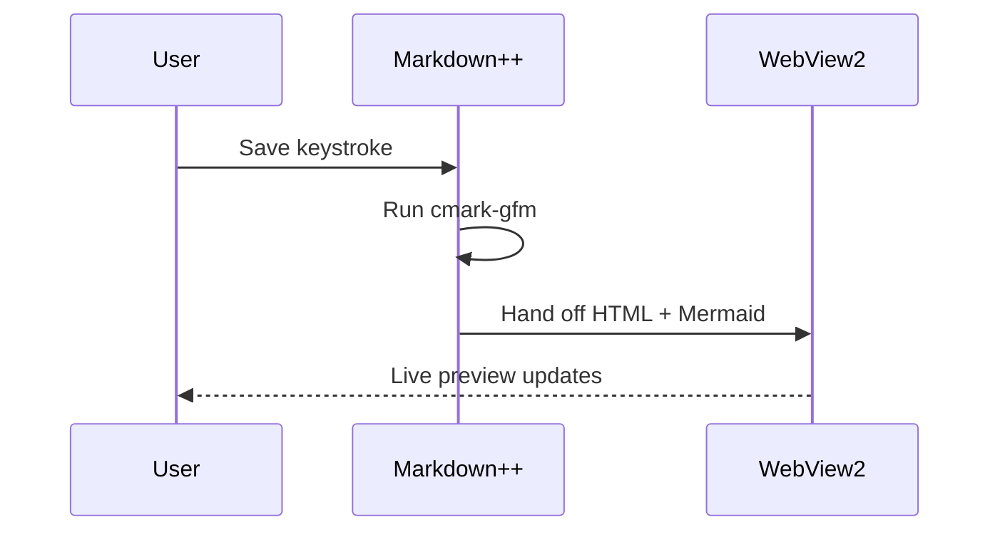
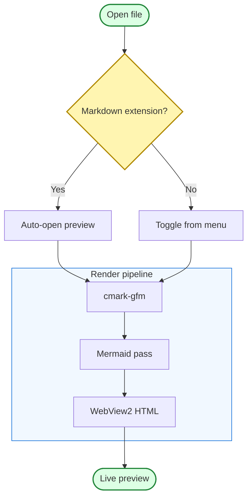

# Mermaid Diagrams In Markdown++

Markdown++ bundles Mermaid and renders it **offline**, so diagrams appear in the
preview with *no network access*. This file mixes short explanations with three
diagrams of increasing complexity so a single screenshot shows both the prose and
the rendered graphs.

Formatting still works around diagrams: **bold**, *italic*, <u>underline</u>, and
`inline code` all render normally between the fenced `mermaid` blocks.

## 1. A simple flowchart

A basic left-to-right flow. Each `A --> B` line is one edge, and the text in
brackets is the node label.

## 2. A sequence diagram

Sequence diagrams show *who talks to whom, and in what order*. Solid arrows are
calls, dashed arrows are responses.

## 3. A more complex flowchart

This one adds a **decision node**, a **subgraph**, and per-node styling. Note the
strict-parser rule: the subgraph uses an explicit alias (`PIPE`) and is styled by
that alias rather than by its quoted title.

If a diagram is malformed, Markdown++ shows the error inline and keeps the other
diagrams on the page working.
