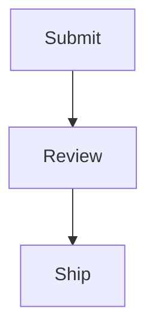

# Clipboard copy fixture

Fixture for `tools/measure-preview-copy.ps1`. Every element below is asserted on, so do not
trim it without updating that script.

This paragraph has **bold text**, *italic text*, and `inline code` in it.

## A table

| Column A | Column B |
| --- | --- |
| one | two |
| three | four |

## A list

- first item with **bold**
- second item with *italic*

## Fenced code

```text
fenced code block
second line
```

> A blockquote, for good measure.

## A diagram


