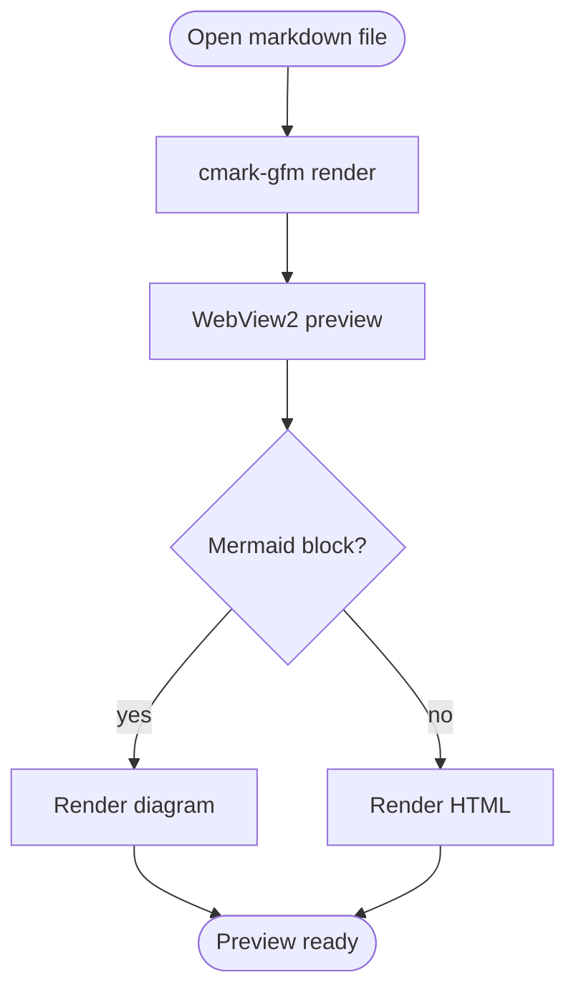
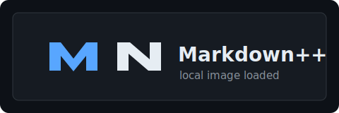

# Markdown++ Native Smoke Test

This file is a focused preview check for the native Markdown++ Notepad++ plugin.
Open it in Notepad++, enable the Markdown++ panel, and confirm the sections below
render without crashes, layout corruption, or broken local resource handling.

## Mermaid



## GitHub-Flavored Markdown

| Feature | Input | Expected |
|---|---|---|
| Tables | This table | Columns align and borders render |
| Task lists | `- [x]` | Checkbox styling appears |
| Strikethrough | `~~removed~~` | Text is struck through |
| Autolinks | `https://example.com` | Link is clickable-looking |
| Footnotes | `[^note]` | Footnote section renders |

- [x] Render headings, paragraphs, and lists
- [x] Render fenced code blocks
- [x] Render Mermaid from the bundled offline asset
- [ ] Preserve scroll position during live edits
- [ ] Add theme compatibility option
- [ ] Copy rendered HTML, export HTML, export PDF, and print from the plugin menu

This sentence includes **bold**, *italic*, `inline code`, ~~removed text~~, and
an autolink: https://example.com/markdownplusplus-smoke

## Code Fences

```powershell
powershell -ExecutionPolicy Bypass -File .\tools\build-native.ps1 -Configuration Release -Package
```

```cpp
std::wstring pluginName = L"Markdown++";
if (!pluginName.empty()) {
    OutputDebugStringW(pluginName.c_str());
}
```

## Local Links And Images

Local Markdown link:
[BUILDING_NATIVE.md](../BUILDING_NATIVE.md)

Local image:



The image above is loaded from the same folder as this Markdown file. If you copy
only this Markdown text to another folder, copy the SVG beside it or the image
check should fail.

External HTTPS image:


## Blocks

> Blockquote text should keep a left border and readable spacing.
>
> Nested paragraphs inside the quote should not collapse into the next section.

1. Ordered list item one
2. Ordered list item two
3. Ordered list item three with nested bullets:
   - Nested bullet A
   - Nested bullet B

Horizontal rule:

---

## Inline HTML

Safe inline HTML should pass through: <kbd>Ctrl</kbd> + <kbd>Shift</kbd> + <kbd>P</kbd>

Dangerous raw HTML should not execute:

<script>alert("Markdown++ smoke test should not run this");</script>

## Footnote

This line references a footnote.[^note]

[^note]: Footnotes are enabled in the native cmark-gfm render path.

## Export And Clipboard

Use the plugin menu actions against this file:

1. `Copy HTML to clipboard` should paste rendered content into HTML-aware targets and an HTML fragment into plain-text targets.
2. `Export HTML...` should save a standalone UTF-8 HTML file with the preview stylesheet and local-image base path.
3. `Export PDF...` should save the current WebView preview as a PDF without a trailing blank page from the EOF spacer. Local Markdown links should not produce permission prompts or preview-only `markdownplusplus.document` links in the PDF; fragment and external HTTPS links may remain clickable.
4. `Print...` should open the system print dialog for the current preview.

Standalone exported HTML should also preserve fragment-only jumps. In the
exported browser page, this link should scroll to the expected behavior section:

[Jump to expected behavior](#expected-behavior)

## Expected Behavior

The standalone exported HTML anchor jump landed here.
